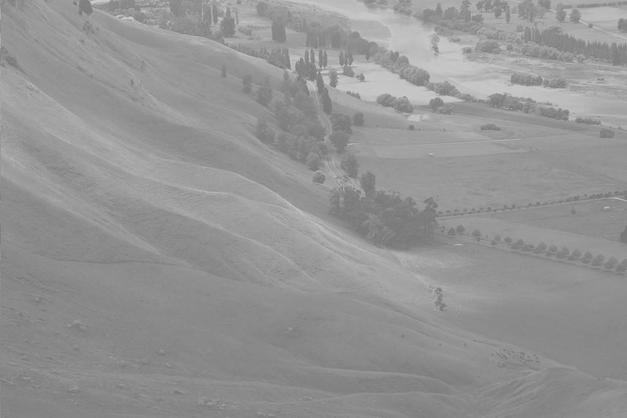
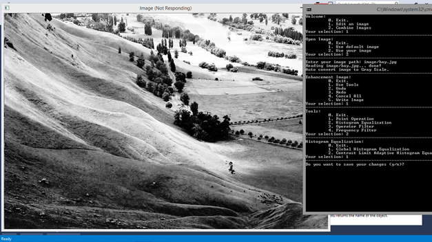
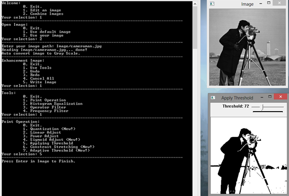
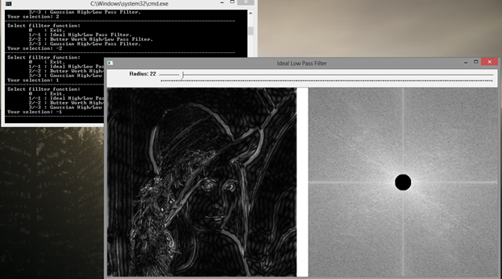
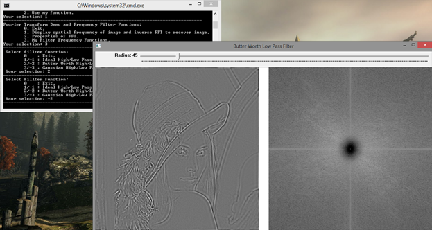

# image-enhancement

## Prequisites
+ C++
+ OpenCV 3. for C++

## Introduction

This project includes image enhancement techniques, developed in C++ with opencv. It focuses on 2 popular approaches:
- Color-based: enhance color
- Edged-based: enhance edges

Considering techniques in details, there are four types:
- Color domain: process on color space, such as RGB, HSV ...
https://github.com/anvy1102/image-enhancement/blob/master/src/convert_ColorModel.h (.CPP)
- Spatial domain: process directly on points. 
https://github.com/anvy1102/image-enhancement/blob/master/src/PointOperation.h (.CPP)
- Histogram domain: process on histogram of images
https://github.com/anvy1102/image-enhancement/blob/master/src/processFrq.h (.CPP)
https://github.com/anvy1102/image-enhancement/blob/master/src/Histogram.h (.CPP)
- Frequency domain: process on frequency domain.

With histogram and frequency domain, mapping with spatial space is neccesary, such as Fast Fourier Transform is algorithms converting image to frequency domain then back to spatial domain after applying some filtering. See https://github.com/anvy1102/image-enhancement/blob/master/src/myFFT.h (.CPP)

Most of these techniques have been built-in in image processing library. However, in this projects, I implemented them by myself. I also implemented other advanced methods, includes Constrast Stretching and Adaptive Threshold with Otsu's method. Checkout here: https://github.com/anvy1102/image-enhancement/blob/master/src/PointOperation.h

The demo of these techniques are in scripts with prefix "Demo" and reported here https://github.com/anvy1102/image-enhancement/blob/master/report/Demo.pdf

Histogram Equalization

Adaptive Threshold - Otsu's method

Ideal High Pass Filtering

Ideal Low Pass Filtering

Butter Worth Low Pass Filtering

